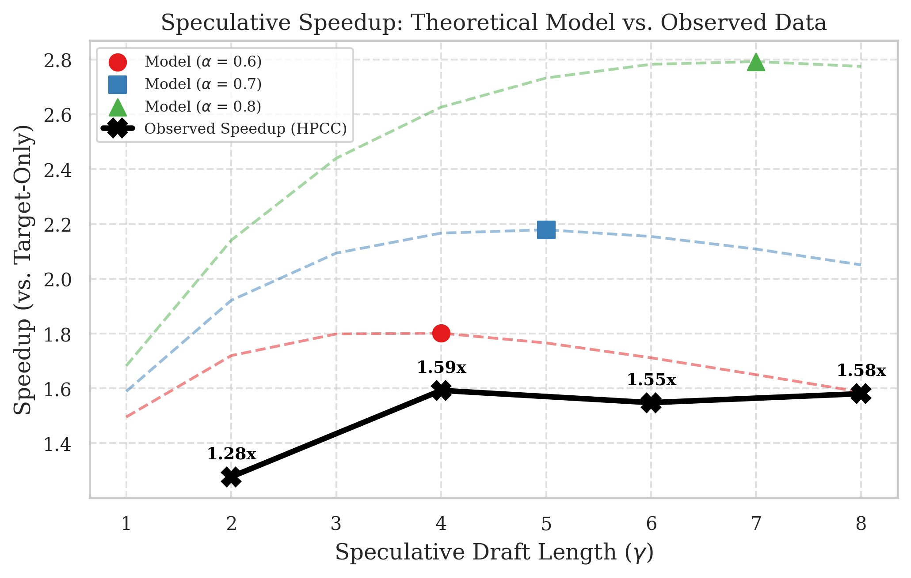

# Pruning Paltry Predictions — a speculative-decoding inference engine in CUDA

**Tobias Moser · Eli Wandless** — CME 213 (Parallel Computing), Stanford, Spring 2026.
Full write-up: [`docs/report.pdf`](docs/report.pdf).

A from-scratch LLM inference engine that runs **Qwen2.5-7B-Instruct** (target) and
**Qwen2.5-0.5B-Instruct** (draft) on hand-written CUDA kernels and accelerates decoding with
**speculative decoding** (Leviathan et al., 2023) across two GPUs over MPI. No PyTorch ops on the hot
path: the forward pass is embedding → RMSNorm → fused-RoPE flash attention / flash decoding →
SwiGLU → residual, all custom kernels tuned for the Quadro RTX 6000 (Turing, SM 7.5), with the GEMMs
dispatched to cuBLAS tensor cores.

| | |
|---|---|
| **Target-only decode** (7B, fp16, batch 1) | **34 tok/s** — 479 GB/s effective, **89 %** of achievable HBM bandwidth |
| **Draft decode** (0.5B, CUDA-graphed) | **299 tok/s** (1.79× over eager launches) |
| **Speculative decoding** (2 GPUs, MPI) | **~1.6× mean speedup** over target-only, up to **2.4×** on code/math prompts; output distribution identical to the target model |
| **MPI overhead per speculative round** | 1.51 ms (~5 % of one target forward) |

<p align="center">
  
  <br><em>Measured end-to-end speedup vs. draft length γ (solid), against the single-α analytical model (dashed).</em>
</p>

---

## What's in here

1. **Custom CUDA kernel suite** (`runtime/production_kernels/`) — two tuned kernel sets, one per
   model (`target`: head_dim 128, `draft`: head_dim 64):
   - FlashAttention-2–style prefill attention on `nvcuda::wmma` tensor-core fragments, with RoPE fused
     into the Q tile load and online softmax so the score matrix is never materialized.
   - Flash-Decoding kernel for the S=1 decode / S≤9 verify regime that splits work along the KV
     cache (split-K + combine) to keep all 72 SMs busy at long context — 3–4× faster than reusing
     the prefill kernel.
   - RoPE fused into the KV-cache write (removes a standalone kernel and two HBM round-trips).
   - Vectorized (128-bit) RMSNorm with warp-shuffle block reductions, fused SwiGLU activation,
     coalesced embedding gather, residual add, lm_head.
   - Device-scalar (`_dev`) variants of the position-dependent ops so the whole forward is
     **CUDA-graph capturable** and one captured graph replays across every step and prompt.
2. **Inference runtime** (`runtime/`) — a config-driven Python host that loads safetensors weights,
   plans VRAM, pre-allocates KV cache / static buffers, and drives prefill, decode, and the
   speculative `verify_gamma` forward through the AOT-compiled kernels. CUDA-graph capture/replay for
   decode and verify is a mixin on the executor.
3. **Speculative decoding** (`runtime/speculative/`) — host-side stochastic accept/reject sampler
   (Algorithm 1 of Leviathan et al.), draft-side γ-loop with KV rollback, target-side verify with a
   deferred "bonus token", a single-process driver, and a two-rank **mpi4py coordinator** (rank 0 =
   7B on `cuda:0`, rank 1 = 0.5B on `cuda:1`).
4. **Kernel development lab** (`kernel_dev/`) — the JIT-build harness each kernel was developed in:
   monkey-patch one custom op into the HuggingFace `Qwen2` module, check `allclose` against the
   reference, time it against eager PyTorch and `torch.compile`, and profile with Nsight
   Systems / Compute.
5. **Benchmarks, profiling drivers, and docs** — throughput sweeps, CUDA-graph and MPI
   micro-benchmarks, `nsys`/`ncu` collection scripts, and extensive design notes and
   implementation journals under [`docs/`](docs/).

---

## How it works

```
                 rank 1 · cuda:1                             rank 0 · cuda:0
        ┌──────────────────────────────┐            ┌──────────────────────────────┐
        │  Qwen2.5-0.5B  (draft, M_q)  │            │   Qwen2.5-7B  (target, M_p)  │
        │  CUDA-graphed decode, γ steps│            │   one verify forward, S=γ+1  │
        │  x_1..x_γ ~ q_i(x)           │            │   p_1..p_{γ+1} for all drafts │
        └──────────────┬───────────────┘            └──────────────┬───────────────┘
                       │  γ token ids + [γ+1, vocab] fp16 logits  │
                       │ ───────────────────────────────────────▶ │   MPI Send/Recv (1.45 MiB)
                       │                                          │
                       │   accept x_i while r_i ≤ p_i(x_i)/q_i(x_i); on the first reject
                       │   resample from norm(max(0, p − q)); else sample a bonus token
                       │                                          │
                       │ ◀─────────────────────────────────────── │   n_accepted, bonus (16 B)
                       │  roll KV cache back to prefix + n,       │  roll KV cache back,
                       │  commit bonus, draft the next γ          │  defer bonus into next verify
```

Every speculative round costs one target forward (the same ~30 ms as a single-token decode, since
both stream all 14.1 GB of weights) plus γ cheap draft steps, and yields between 1 and γ+1 tokens.
The sampling rule guarantees the emitted sequence is an exact sample from the target's distribution;
with greedy standardization the engine reproduces the 7B's own greedy output token-for-token, which is
the end-to-end correctness gate.

**Why two GPUs / MPI:** the draft proposes the next γ tokens while the target is still verifying, and
each model owns a full GPU's bandwidth. The draft→target payload dominates communication (1.45 MiB at
γ=4) but a whole round of MPI + D2H/H2D costs only 1.51 ms — see
[`docs/mpi_benchmarks.md`](docs/mpi_benchmarks.md).

---

## Results

All numbers: Quadro RTX 6000 (24 GB GDDR6, ~672 GB/s), fp16, batch 1, Stanford HPCC.

### Single-model throughput vs. the roofline

The decode phase is memory-bound: every token streams the full weight set from HBM. The target hits
89 % of achievable bandwidth; the draft is too small to keep enough bytes in flight
(Little's law, Q* ≈ 270 KB) and lands where that model predicts.

| Model | Weights streamed / token | Bandwidth ceiling | Little's-law estimate | **Measured** |
|---|---:|---:|---:|---:|
| Qwen2.5-7B (target) | 14.1 GB | 38 tok/s | ~34 tok/s | **34.0 tok/s** (479 GB/s) |
| Qwen2.5-0.5B (draft) | 0.99 GB | 550 tok/s | ~310 tok/s | **299 tok/s** (296 GB/s) |

Full-forward sweep over prompt length S (tok/s):

| S | 7B prefill | 7B decode | 0.5B prefill | 0.5B decode |
|---:|---:|---:|---:|---:|
| 64 | 1479 | 33.2 | 8183 | 303.7 |
| 128 | 2691 | 33.1 | 16166 | 301.0 |
| 512 | 4641 | 32.7 | 38960 | 291.8 |
| 2048 | 4490 | 31.2 | 37744 | 264.5 |

Decode latency rises only with the linear KV-cache read (0.8 % of the weight stream at S=2048 for the
7B), as predicted.

### CUDA graphs: pay off where you're launch-bound

The 0.5B draft's forward is ~150 kernel launches over ~1 GB of weights, so the GPU finishes each
kernel before the host can enqueue the next. Capturing the forward into one graph lifts draft decode
**167 → 299 tok/s (1.79×)**. The 7B target is bandwidth-bound and its launch overhead is already
hidden behind GPU work, so graphing it is exactly **1.00×** — measured, not assumed
([`docs/target_graph_benchmarks.md`](docs/target_graph_benchmarks.md)). Both graphs are bit-exact
against eager execution.

### Speculative decoding end-to-end (2 GPUs)

Latest committed run — `runtime/benchmarks/specdec_bench.py`, stochastic sampling, 128 new tokens per
prompt, seven MT-Bench prompts, raw output in
[`runtime/benchmarks/specdec_report.txt`](runtime/benchmarks/specdec_report.txt).
Baseline is a target-only vLLM reference (32.7 tok/s).

| Prompt (category) | γ=2 | γ=4 | γ=6 | γ=8 |
|---|---:|---:|---:|---:|
| writing | 1.16× | 1.12× | 1.13× | 1.01× |
| reasoning | 1.36× | 1.71× | 1.65× | 1.58× |
| coding | 1.61× | 2.00× | 2.27× | **2.39×** (78.6 tok/s) |
| math | 1.54× | 1.99× | 1.96× | 2.15× |
| knowledge | 1.26× | 1.48× | 1.39× | 1.28× |
| coding (long prompt) | 1.38× | 1.61× | 1.72× | 1.63× |
| reasoning (long prompt) | 1.45× | 2.15× | 1.65× | 2.01× |
| **mean tok/s** | 45.6 | 56.3 | 54.9 | 56.3 |

Speedup tracks the acceptance rate α: structured prompts (code, math) accept 3–5 drafts per round
and approach the model's 1/(1−α) ceiling, while free-form prose barely clears baseline. The optimum
sits at a small γ (≈4), as the analytical model in the report predicts. End-to-end speed is therefore
bound by how well the 0.5B approximates the 7B — not by the hardware.

### Kernel-level optimizations that mattered

| Change | Effect |
|---|---|
| Fuse RoPE into the KV-cache write and the flash-attention Q tile | 3 launches / 49.8 µs → 1 launch / 18.7 µs (2.7×); attention kernel 184.8 → 163.1 µs |
| Flash-Decoding kernel (block along KV history) instead of the prefill kernel for decode | 168.6 → 53.2 µs at 1 K context, 816 → 188 µs at 4 K, 3234 → 706 µs at 16 K (3–4×) |
| CUDA-graph capture of the draft forward | draft decode 167 → 299 tok/s (1.79×) |
| CUDA-graph capture of the target forward | 1.00× — not worth it, and the profile says why |

The one optimization that didn't pay: graphing the 7B target. It took real engineering (every
host-side scalar in the forward had to move to device memory) and bought nothing because the target
was never launch-bound. Details in [`docs/cuda_graph_issues_and_concepts.md`](docs/cuda_graph_issues_and_concepts.md).

---

## Repository layout

```
.
├── runtime/                      # the inference engine
│   ├── core/                     #   YAML config → RuntimeConfig, shape/VRAM planning, safetensors loading
│   │   └── configs/              #   qwen2.5-7b.yaml (kernel_set=target), qwen2.5-0.5b.yaml (draft)
│   ├── buffers.py                #   pre-allocated KV cache, RoPE tables, ping-pong hidden states, graph scratch
│   ├── executor.py               #   Qwen2Executor: prefill / decode_step / verify_gamma / rollback_cache
│   ├── executor_graph.py         #   GraphExecutorMixin: CUDA-graph capture + replay (decode & verify)
│   ├── production_kernels/       #   AOT-compiled CUDA extensions, one tree per model role
│   │   ├── target/<op>/          #     7B kernels (head_dim 128): kernel.cu · bindings.cpp · ops.py
│   │   └── draft/<op>/           #     0.5B kernels (head_dim 64), same layout
│   │       ops ∈ {attention, embedding, rmsnorm, swiglu, residual_ops}
│   ├── speculative/              #   sampler, draft_runner, target_step, spec_decode, mpi_protocol, mpi_coordinator
│   ├── benchmarks/               #   specdec_bench (2-GPU suite), graph benchmarks, HF baseline, prompts
│   ├── tools/profile_forward.py  #   nsys-instrumented full-forward driver (NVTX ranges per op/layer/phase)
│   └── tests/                    #   unit + GPU parity tests (kernels vs HF, graph vs eager, spec decode vs greedy)
├── kernel_dev/                   # kernel development lab (JIT build + HF monkey-patch harness)
│   ├── target/kernels/<op>/      #   kernel.cu · bindings.cpp · jit.py · wrapper.py · benchmark.py · run_benchmark.sh
│   ├── draft/kernels/<op>/       #   same, for 0.5B dims (attention has per-sub-op benchmark_scripts/)
│   ├── models/                   #   verbatim HF modeling_qwen2.py (patch-target reference) + weight loading helpers
│   └── profiling.py              #   nsys/ncu output placement shared by the benchmarks
├── mpi_prototype/                # model-free 2-rank mpi4py smoke test + the MPI transfer benchmark
├── scripts/                      # build_kernels.sh, profiling/benchmark sweeps, env + model download
├── slurm/                        # srun/sbatch wrappers for the gpu-turing partition (1- and 2-GPU jobs)
├── docs/                         # report, figures, architecture + kernel docs, implementation journals
├── setup.py                      # AOT build of runtime/production_kernels (BUILD_ROLE / BUILD_KERNEL)
└── setup.sh                      # cluster environment (conda env, modules, model paths)
```

---

## Running it

Everything below targets the Stanford HPCC `gpu-turing` partition (Quadro RTX 6000, CUDA 12.2,
Python 3.11, PyTorch 2.4). The kernels are compiled for `sm_75`; other Turing cards should work,
other architectures need `NVCC_FLAGS` in `setup.py` changed.

```bash
# 1. environment (once) + per-shell activation
bash scripts/create_conda_env.sh          # conda env `cme213` from requirements.txt
source setup.sh                           # activates env, loads gnu12, exports QWEN_*_PATH

# 2. weights (~15 GB) and a load sanity check
bash scripts/download_models.sh
srun --partition=gpu-turing --gres=gpu:1 --pty python scripts/verify_env.py

# 3. build the AOT kernel extensions (attention needs a compute node's RAM)
bash scripts/build_kernels.sh             # both roles, all ops → *.so next to each ops.py
bash scripts/build_kernels.sh draft attention

# 4. tests
python -m unittest runtime.tests.test_config runtime.tests.test_mpi_protocol   # CPU
bash slurm/run_tests_gpu.sh runtime.tests.test_rmsnorm                          # one GPU module per job
bash slurm/run_tests_gpu.sh runtime.tests.test_decode_graph
bash slurm/run_tests_gpu.sh runtime.tests.test_spec_decode

# 5. speculative decoding on 2 GPUs (rank 0 = 7B target, rank 1 = 0.5B draft)
bash slurm/run_speculative.sh --steps 32 --gamma 4
bash slurm/run_specdec_bench.sh --gammas 2 4 6 8     # full γ sweep → runtime/benchmarks/specdec_report.txt

# 6. single-model throughput + profiling
bash scripts/benchmark_forward.sh --model target --seq-lens 128,512,2048
bash scripts/profile_forward.sh --model draft --graph          # nsys timeline of the graph replay
bash kernel_dev/target/kernels/attention/run_benchmark.sh benchmark_decode_attn --profile   # ncu on one op
bash mpi_prototype/run_mpi.sh --slurm-gpu --benchmark          # MPI transfer latency breakdown
```

Using the runtime from Python:

```python
from runtime import CONFIG_7B, RuntimeConfig, load_weights_on_gpu, allocate_buffers, Qwen2Executor
from runtime.speculative.draft_runner import DraftRunner
from runtime.speculative.spec_decode import speculative_generate

cfg = RuntimeConfig.from_yaml(CONFIG_7B, project_root=PROJECT_ROOT)      # or CONFIG_05B
weights, _ = load_weights_on_gpu(cfg, batch=1, device="cuda")
buffers = allocate_buffers(cfg, batch=1, max_seq_len=2048, device="cuda")
target = Qwen2Executor(cfg, weights, buffers)                              # kernel_set from the YAML

logits = target.prefill(input_ids)                                         # [1, S, vocab]
seq = target.greedy_extend(input_ids, n_new_tokens=64)                     # plain autoregressive decode

# both models fit on one 24 GB card for single-process speculative decoding
res = speculative_generate(target, DraftRunner(draft, seed=0), prompt_ids, n_new_tokens=64, gamma=4)
```

---

## Correctness

- **Per kernel:** every op is compared against the corresponding HuggingFace `Qwen2` module
  (`Qwen2RMSNorm`, `Qwen2MLP`, `Qwen2Attention`, `F.embedding`) with random and real weights across a
  grid of (batch, seq) shapes, `allclose` at ε = 1e-3 (`runtime/tests/test_*.py`,
  `kernel_dev/*/kernels/*/benchmark.py`).
- **Per model:** the native executor's greedy trajectory matches `transformers` generation for both
  models (`runtime/tests/test_parity_greedy.py`, `test_decoder_layer.py`).
- **CUDA graphs:** captured decode and verify graphs are `torch.equal` to eager execution over
  multi-step trajectories and across prompts (`test_decode_graph.py`, `test_verify_graph.py`).
- **Speculative decoding:** with greedy standardization the draft + target + accept/reject + KV
  rollback pipeline reproduces the target's own greedy sequence exactly
  (`test_spec_decode.py`); the MPI coordinator's committed sequence matches on both ranks.

---

## Documentation

| Read this for… | File |
|---|---|
| The full report: modeling, results, scaling analysis | [`docs/report.pdf`](docs/report.pdf) |
| Runtime architecture, memory planning, the forward pass step by step | [`docs/runtime_architecture_and_execution.md`](docs/runtime_architecture_and_execution.md) |
| How kernels are built, bound, tested, and wired into the executor | [`docs/runtime_kernel_system.md`](docs/runtime_kernel_system.md) |
| Flash-Decoding / small-q attention design | [`docs/decode_attention_design.md`](docs/decode_attention_design.md) |
| CUDA graphs: concepts, then the journal of every issue hit making the forward capturable | [`docs/cuda_graphs_explained.md`](docs/cuda_graphs_explained.md), [`docs/cuda_graph_issues_and_concepts.md`](docs/cuda_graph_issues_and_concepts.md) |
| Graph benchmark results (target 1.00×, draft 1.64–1.79×) | [`docs/target_graph_benchmarks.md`](docs/target_graph_benchmarks.md), [`docs/draft_graph_benchmarks.md`](docs/draft_graph_benchmarks.md) |
| The speculative sampling algorithm as implemented | [`docs/speculative_decoding.md`](docs/speculative_decoding.md) |
| MPI wire protocol and transfer benchmarks | [`docs/mpi_benchmarks.md`](docs/mpi_benchmarks.md), [`mpi_prototype/README.md`](mpi_prototype/README.md) |
| Porting the 7B kernels to 0.5B dims | [`docs/draft_kernel_migration.md`](docs/draft_kernel_migration.md) |
| Kernel dev workflow, HF monkey-patching, cluster build pitfalls, GPU spec | [`docs/kernel_development_workflow.md`](docs/kernel_development_workflow.md), [`docs/kernel_monkey_patching.md`](docs/kernel_monkey_patching.md), [`docs/common_kernel_errors.md`](docs/common_kernel_errors.md), [`docs/gpu_spec.md`](docs/gpu_spec.md) |

---

## References

- Leviathan, Kalman, Matias. *Fast Inference from Transformers via Speculative Decoding.* ICML 2023. [arXiv:2211.17192](https://arxiv.org/abs/2211.17192)
- Dao et al. *FlashAttention: Fast and Memory-Efficient Exact Attention with IO-Awareness.* 2022. [arXiv:2205.14135](https://arxiv.org/abs/2205.14135)
- Dao, Haziza, Massa, Sizov. *Flash-Decoding for long-context inference.* PyTorch blog, 2023.
- Su et al. *RoFormer: Enhanced Transformer with Rotary Position Embedding.* [arXiv:2104.09864](https://arxiv.org/abs/2104.09864)
- Miao et al. *SpecInfer: Accelerating LLM Serving with Tree-based Speculative Inference and Verification.* ASPLOS 2024.
- Cai et al. *Medusa: Simple LLM Inference Acceleration Framework with Multiple Decoding Heads.* 2024.
