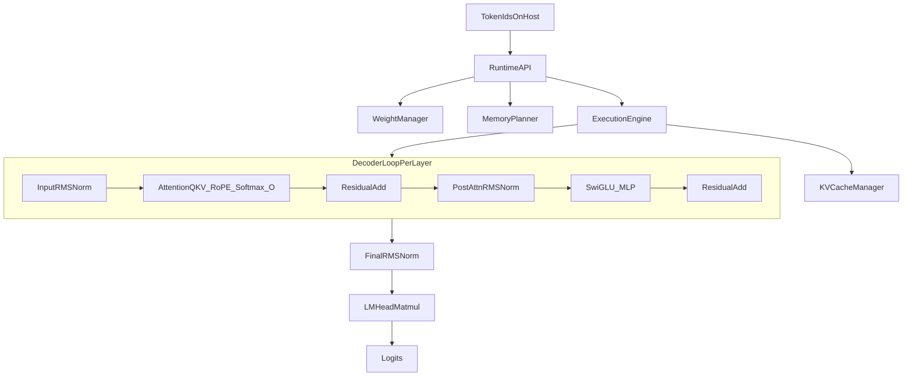

# Qwen2 Native Forward-Pass Execution Plan

## Goal and Scope
- Build a native C++/CUDA host runtime that executes Qwen2 forward pass end-to-end using your custom kernels.
- Keep monkey patching for isolated kernel development and validation only.
- Target **single-GPU inference first** (prefill + decode with KV cache), with explicit interfaces that later support speculative decoding and multi-GPU orchestration.

## Current Baseline (What We Anchor To)
- Reference architecture and execution order are in [`/home/cme213/tobiascm/cme213-final-project/src/reference/modeling_qwen2.py`](/home/cme213/tobiascm/cme213-final-project/src/reference/modeling_qwen2.py).
- Existing custom kernel scaffolding is per-op under [`/home/cme213/tobiascm/cme213-final-project/src/kernels/`](/home/cme213/tobiascm/cme213-final-project/src/kernels/) with only RMSNorm currently implemented.
- Existing monkey-patching strategy is documented in [`/home/cme213/tobiascm/cme213-final-project/skills/kernel_monkey_patching_plan.md`](/home/cme213/tobiascm/cme213-final-project/skills/kernel_monkey_patching_plan.md).

## Guiding Architecture Decisions
- **Separate concerns hard**:
  - Kernel implementation: each op module (`rmsnorm`, `attention`, `swiglu`, etc.) remains independently testable.
  - Runtime orchestration: one host-side executor handles graph order, buffers, weights, and cache lifecycle.
- **Stable op ABI**: every kernel should expose a predictable host API (`init`, `workspace_bytes`, `run`).
- **Weight ownership centralized**: one model-weight manager owns host metadata + device allocations and layer-indexed views.
- **Memory plan explicit**: no ad-hoc temporary tensor creation during decode; pre-allocate and reuse buffers.

## Target Runtime Topology

## Step-by-Step Execution Plan

### Phase 1: Define Runtime Contract and File Layout
- Create a dedicated native runtime area (for example: `src/runtime/`) with clear modules:
  - `model_config` (dims, head counts, layer count, rope params)
  - `weight_manager` (loads/maps weights, owns device pointers)
  - `tensor_registry` + `memory_planner` (named activation buffers)
  - `op_dispatch` (host wrappers for each kernel module)
  - `decoder_executor` (layer loop)
  - `qwen2_executor` (top-level prefill/decode API)
- Specify canonical tensor shapes/layouts for every boundary (especially attention and KV cache).
- Lock dtype policy for V1 (recommend FP16 data path with FP32 accum where needed).

### Phase 2: Weight Ingestion and Device Residency
- Implement a one-time load path that:
  - reads model metadata and validates dims against runtime config;
  - allocates contiguous or grouped device buffers;
  - creates per-layer typed views for all weights (`q_proj`, `k_proj`, `v_proj`, `o_proj`, MLP projections, layernorm weights, embeddings, final norm, lm head).
- Add startup validation checks:
  - missing tensors;
  - shape mismatch;
  - incompatible hidden-size alignment constraints (e.g., vectorized RMSNorm assumptions).
- Add a simple memory report at startup (weights + cache + activations).

### Phase 3: Kernel Interface Unification
- Wrap each op in a host-callable interface with common semantics:
  - input/output pointers, shape struct, stream, workspace pointer.
- For each op module, add:
  - standalone correctness test vs PyTorch baseline;
  - micro-benchmark;
  - integration test entrypoint for runtime-level calls.
- Keep monkey-patching wrappers as validation tools only; do not couple runtime execution to Python module patching.

### Phase 4: Activation and KV-Cache Memory Planning
- Build a deterministic activation buffer plan:
  - ping-pong hidden-state buffers per layer;
  - dedicated buffers for attention intermediates and MLP intermediates;
  - reusable scratch workspace pools.
- Implement KV cache manager with explicit layout decisions for decode (layer-major recommended):
  - per-layer `K`/`V` storage;
  - append/update API by `cache_position`;
  - capacity checks and optional sliding window hooks.
- Ensure prefill and token-by-token decode share infrastructure rather than separate code paths.

### Phase 5: Implement Decoder Layer Executor (Parity First)
- Mirror reference layer order from Qwen2 exactly:
  - input RMSNorm -> self-attention (+ residual) -> post-attention RMSNorm -> MLP (+ residual).
- Keep RoPE and repeat-kv semantics consistent with reference model behavior.
- Start with eager attention variant equivalent behavior (no flash-specific branch complexity in first integration).
- Add per-layer debug mode to dump/check selected activations against PyTorch for one token/batch.

### Phase 6: Implement Full Model Executor
- End-to-end sequence:
  - token embedding lookup;
  - rotary embedding preparation;
  - decoder layer loop;
  - final RMSNorm;
  - lm_head projection to logits.
- Expose two public APIs:
  - `prefill(input_ids, attention_mask)` -> logits + initialized cache;
  - `decode_step(next_input_id, cache_state)` -> logits + updated cache.
- Keep runtime API stateless where possible; store mutable decode state in explicit context objects.

### Phase 7: Verification and Regression Harness
- Build parity harness against HF reference (`modeling_qwen2`) with staged checks:
  - op-level tolerance checks;
  - layer-output checks;
  - full logits checks for short prompts;
  - decode trajectory checks (argmax token match across several steps).
- Define tolerance matrix by op/type/sequence length.
- Add CI-like script targets for:
  - smoke (1 layer / tiny input),
  - correctness (full small model),
  - performance sanity.

### Phase 8: Performance Pass and Profiling Hooks
- Add timing instrumentation around major runtime regions:
  - embedding, per-layer attention, per-layer MLP, norm, lm head, cache update.
- Introduce stream/event-based profiling utilities from start (even if single stream initially).
- Optimize once parity is stable: buffer fusion opportunities, launch configuration tuning, memory reuse improvements.

### Phase 9: Future-Proof Interfaces (SpecDec + Multi-GPU)
- Bake extension points now:
  - pluggable `ExecutionPolicy` (single GPU now, OpenMP coordinator later);
  - pluggable `DecodeStrategy` (greedy now, speculative later);
  - explicit serialization format for cache/state handoff.
- Keep per-device state encapsulated so speculative target/draft models can run as separate executors sharing tokenizer/protocols.

## Risks and Mitigations
- **Risk:** Kernel shape/layout mismatch at integration boundaries.
  - **Mitigation:** enforce compile-time/runtime shape assertions and single source of truth for tensor descriptors.
- **Risk:** Accuracy drift due to dtype/reduction differences.
  - **Mitigation:** staged parity checks and per-op tolerance policy before performance tuning.
- **Risk:** Decode-path complexity explosion.
  - **Mitigation:** unify prefill/decode executor core with explicit cache API and minimal branching.

## Initial Milestones (Suggested)
- **M1:** Runtime skeleton + weight manager + memory planner (no real kernels, can run mock ops).
- **M2:** Integrate RMSNorm + placeholder attention/MLP stubs, complete layer loop skeleton.
- **M3:** Attention and SwiGLU real kernel integration, first full forward logits parity on short prompt.
- **M4:** Prefill + decode-step parity and stable performance baseline.
- **M5:** Interface hardening for speculative decode and multi-GPU coordinator integration.

## Immediate Next Actions
- Freeze V1 runtime contract (tensor descriptors, op ABI, cache layout).
- Implement weight manager and activation planner before adding more kernels.
- Integrate kernels in strict dependency order: RMSNorm -> Attention path -> MLP path -> final lm_head path.
- Stand up parity harness early; do not defer correctness checks until all kernels are integrated.
