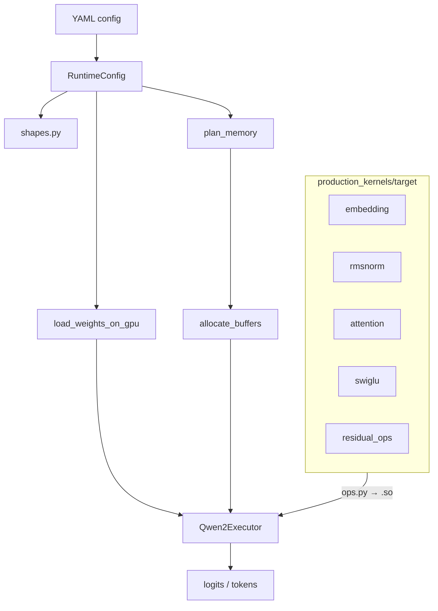

# Runtime Architecture and Execution

A complete reference for the `runtime/` package: directory layout, memory/buffer allocation, and the exact sequence of operations that produce a Qwen2 forward pass — including prefill, decode, KV cache semantics, and sampling.

For kernel build/import details, see [runtime_kernel_system.md](runtime_kernel_system.md).

---

## Table of contents

1. [Purpose and design](#1-purpose-and-design)
2. [Directory structure](#2-directory-structure)
3. [Configuration (`core/`)](#3-configuration-core)
4. [Shape and memory planning](#4-shape-and-memory-planning)
5. [Weight loading](#5-weight-loading)
6. [Buffer allocation (`buffers.py`)](#6-buffer-allocation-bufferspy)
7. [Production kernels](#7-production-kernels)
8. [The executor (`executor.py`)](#8-the-executor-executorpy)
9. [End-to-end forward pass](#9-end-to-end-forward-pass)
10. [Prefill vs decode](#10-prefill-vs-decode)
11. [KV cache and `cache_position`](#11-kv-cache-and-cache_position)
12. [Inference loop and sampling](#12-inference-loop-and-sampling)
13. [Limitations and future work](#13-limitations-and-future-work)
14. [Quick reference: typical call sequence](#14-quick-reference-typical-call-sequence)

---

## 1. Purpose and design

`runtime/` is a **minimal Python inference host** for Qwen2.5 models. It loads model constants from YAML, loads FP16 weights from safetensors, pre-allocates GPU buffers, and drives a decoder loop that calls **ahead-of-time (AOT) compiled CUDA extensions** for every compute op.

Design principles (from `runtime/plan.md`):

| Principle | What it means in practice |
|-----------|---------------------------|
| Config-driven | One YAML per model; `head_dim`, buffer shapes, and layer order are derived, not duplicated in code |
| Python host + CUDA compute | Orchestration in Python; math in `kernel.cu` + pybind |
| Single model per GPU | VRAM budgeting assumes exactly one model's weights on a device |
| No runtime JIT | Extensions are built once via `scripts/build_kernels.sh` |

The public entry point re-exports the main types from `runtime/__init__.py`:

```python
from runtime import (
    RuntimeConfig, CONFIG_7B, CONFIG_05B,
    load_weights_on_gpu, plan_memory, allocate_buffers,
    Qwen2Executor,
)
```

---

## 2. Directory structure

```
runtime/
├── __init__.py                 # Public API exports
├── executor.py                 # Qwen2Executor — prefill / decode / greedy_extend
├── buffers.py                  # RuntimeBuffers + allocate_buffers()
├── README.md                   # Quick start (partially stale vs plan.md)
├── plan.md                     # Implementation roadmap and phase status
│
├── core/                       # Model-agnostic infrastructure
│   ├── config.py               # RuntimeConfig dataclass + YAML loader
│   ├── configs/
│   │   ├── qwen2.5-7b.yaml     # Production target (head_dim=128)
│   │   └── qwen2.5-0.5b.yaml   # Fast parity / dev (head_dim=64)
│   ├── shapes.py               # Tensor shape + byte-count helpers
│   ├── memory.py               # plan_memory(), VRAM budget helpers
│   └── weights.py              # safetensors load, validate, VRAM snapshot
│
├── production_kernels/
│   └── target/                 # Main-model CUDA ops (one folder per op)
│       ├── rmsnorm/            # kernel.cu, bindings.cpp, ops.py, *.so
│       ├── embedding/
│       ├── attention/          # QKV proj, RoPE+KV write, fused/decode attn, O proj
│       ├── swiglu/
│       └── residual_ops/       # residual_add + lm_head
│
└── tests/                      # Unit tests + HF parity harness
    ├── _support.py             # Config loaders, PROJECT_ROOT
    ├── parity_support.py       # HF vs executor comparison helpers
    ├── test_config.py
    ├── test_shapes.py
    ├── test_memory.py
    ├── test_weights.py
    ├── test_buffers.py
    ├── test_executor.py        # Full-model prefill/decode parity
    ├── test_decoder_layer.py
    ├── test_parity_greedy.py
    └── test_<op>.py            # Per-kernel GPU parity
```

**Data flow (high level):**



---

## 3. Configuration (`core/`)

### `RuntimeConfig`

Loaded from YAML via `RuntimeConfig.from_yaml(path, project_root=...)`. The dataclass holds:

- **Architecture**: `hidden_size`, `intermediate_size`, `num_hidden_layers`, `num_attention_heads`, `num_key_value_heads`, `vocab_size`, `rms_norm_eps`, `rope_theta`, `max_position_embeddings`, `tie_word_embeddings`, `hidden_act`
- **Runtime policy**: `dtype` (fp16), `accum_dtype` (fp32), `cuda_arch` (sm_75)
- **Inference limits**: `max_batch`, `max_seq_len` (defaults; overridable at `allocate_buffers` time)
- **Layout / ordering**: `kv_cache_layout` (`layer_major`), `layer_order` (decoder micro-op sequence)

Derived properties (not stored in YAML):

| Property | Formula |
|----------|---------|
| `head_dim` | `hidden_size // num_attention_heads` |
| `kv_dim` | `num_key_value_heads * head_dim` |
| `num_kv_groups` | `num_attention_heads // num_key_value_heads` (GQA group size) |
| `dtype_bytes` | 2 for fp16 |

`validate()` enforces divisibility of heads, `hidden_act == "silu"`, and supported dtype.

Bundled configs:

| Config | `head_dim` | Layers | Q heads | KV heads | `tie_word_embeddings` |
|--------|------------|--------|---------|----------|-------------------------|
| `qwen2.5-7b.yaml` | 128 | 28 | 28 | 4 | false |
| `qwen2.5-0.5b.yaml` | 64 | 24 | 14 | 2 | true |

### Decoder layer order

Both YAMLs use the same `layer_order`, matching HuggingFace `Qwen2DecoderLayer`:

```
input_rmsnorm → attention → residual_add → post_attn_rmsnorm → swiglu_mlp → residual_add
```

The executor interprets this list as a **state machine** (not hard-coded control flow), so reordering in YAML would change execution without editing Python.

---

## 4. Shape and memory planning

### `shapes.py`

Pure functions that map `(batch, seq, cfg)` → tensor shapes:

| Helper | Shape |
|--------|-------|
| `hidden(batch, seq, cfg)` | `[batch, seq, hidden_size]` |
| `q_states(batch, seq, cfg)` | `[batch, num_attention_heads, seq, head_dim]` |
| `kv_states(batch, seq, cfg)` | `[batch, num_key_value_heads, seq, head_dim]` |
| `logits(batch, seq, cfg)` | `[batch, seq, vocab_size]` |
| `kv_cache(batch, max_seq, cfg)` | `[num_layers, batch, num_kv_heads, max_seq, head_dim]` |
| `rope_table(max_seq, cfg)` | `[max_seq, head_dim]` |

`kv_cache_head_dim(cfg)` may pad `head_dim` so each cache row is 16-byte aligned (Turing). For current Qwen2.5 configs, `head_dim` is already aligned (64 or 128 × 2 bytes = 16 or 256).

`weight_shapes(cfg)` and `total_weight_bytes(cfg)` estimate per-layer and global weight memory.

### `plan_memory(cfg, batch, max_seq_len)`

Returns a dict with:

- `buffers`: name → shape tuple for every pre-allocated buffer
- `buffer_bytes`: name → nbytes
- `weight_bytes`, `activation_bytes`, `kv_cache_bytes`, `runtime_bytes`, `total_bytes`
- Human-readable MiB fields

**Scaling:** All activation and KV buffers scale **linearly** with `max_seq_len`. Only `cache_position` is fixed (8 bytes, one int64 scalar).

`max_seq_len_for_budget()` and `max_seq_len_after_weights()` answer: given free VRAM after weights, what is the largest sequence length that fits?

---

## 5. Weight loading

### `load_weights(cfg, device)`

1. Find safetensors shards via `model.safetensors.index.json` or single `model.safetensors`
2. `validate_weights()` — every expected HF key present with correct shape
3. Cast to `cfg.dtype` and move to device **one tensor at a time** (limits host peak memory)

Expected keys follow HuggingFace naming: `model.embed_tokens.weight`, `model.layers.{i}.*`, `model.norm.weight`, and optionally `lm_head.weight`.

### `load_weights_on_gpu(cfg, ...)`

Clears CUDA cache, loads weights, returns `(weights, vram_budget)`. The budget dict includes `max_seq_len` computable from remaining HBM after weights + 512 MiB reserve.

**Constraint:** Never load 7B and 0.5B on the same GPU simultaneously; budget math assumes a single model.

### QKV stacking (executor init, not weights.py)

At `Qwen2Executor.__init__`, per-layer Q/K/V projection weights and biases are **concatenated** into fused `w_qkv` `[H_q + 2*H_kv, hidden]` and `b_qkv` for the attention kernel's single GEMM:

```python
w_qkv = cat([q_proj.weight, k_proj.weight, v_proj.weight], dim=0)
b_qkv = cat([q_proj.bias, k_proj.bias, v_proj.bias], dim=0)
```

Qwen2.5 uses **biased** Q/K/V projections; the fused kernel relies on `beta=1` GEMM into a bias-broadcast output.

---

## 6. Buffer allocation (`buffers.py`)

### `allocate_buffers(cfg, batch, max_seq_len, device)`

Calls `plan_memory()`, then allocates on device:

| Buffer | Allocation | Used by executor today? |
|--------|------------|-------------------------|
| `hidden_a`, `hidden_b` | `torch.empty` (uninitialized) | **No** — reserved for ping-pong / CUDA graphs |
| `q_states`, `k_states`, `v_states` | `torch.empty` | **No** — kernels allocate their own temporaries |
| `mlp_gate` | `torch.empty` | **No** |
| `logits` | `torch.empty` | **No** — `lm_head_forward` returns a new tensor |
| `kv_cache_k`, `kv_cache_v` | `torch.zeros` | **Yes** — persistent KV store |
| `rope_cos`, `rope_sin` | precomputed | **Yes** — sliced per step |
| `cache_position` | `torch.zeros((), int64)` | **Yes** — device mirror of sequence cursor |

**Important:** Phase 4 pre-allocates the full activation footprint for VRAM accounting and future zero-allocation decode (Phase 7 CUDA graphs). The current executor passes **fresh tensors** produced by kernel ops (e.g. `at::empty` inside CUDA) through the layer stack. Only KV cache, RoPE tables, and `cache_position` are actively read/written during inference.

### KV cache layout

Layer-major, shape:

```
[num_hidden_layers, batch, num_key_value_heads, max_seq_len, head_dim]
```

Per-layer views:

```python
cache_k = buffers.kv_cache_k_layer(layer)  # [batch, num_kv_heads, max_seq_len, head_dim]
```

### RoPE tables

`build_rope_tables(cfg, max_seq_len, device)` precomputes `cos` and `sin` for positions `[0, max_seq_len)` with shape `[max_seq_len, head_dim]`, matching HF `Qwen2RotaryEmbedding` (default rope, no scaling).

At inference time, `buffers.rope_embeddings(start, length)` slices `[start : start+length)` and expands to `[batch, length, head_dim]` for the attention kernels.

### `cache_position`

A **0-D int64 tensor** on GPU, kept in sync with the host-side `executor._cache_pos` for future CUDA Graph capture (avoid `.item()` in the hot path). Updated via:

- `reset_cache_position(0)` at prefill start
- `add_(1)` after each single-token decode step
- `fill_(new_pos)` after multi-token prefill

---

## 7. Production kernels

Each op under `production_kernels/target/<op>/`:

```
kernel.cu       # CUDA kernels + C++ launchers
bindings.cpp    # pybind11 exports
ops.py          # Python ABI (only surface the executor imports)
target_<op>_ops*.so   # AOT extension (built in-place)
```

### Op summary

| Op | Python entry | Role |
|----|--------------|------|
| **embedding** | `embedding_forward(input_ids, weight)` | Token lookup → `[batch, seq, hidden]` |
| **rmsnorm** | `forward(x, weight, eps)` | RMSNorm on last dim |
| **attention** | `qkv_proj_forward`, `rope_kv_write_forward`, `fused_attn_forward`, `decode_attn_forward`, `o_proj_forward` | Full attention block |
| **swiglu** | `swiglu_forward(x, w_gate, w_up, w_down)` | SiLU(gate) ⊙ up → down |
| **residual_ops** | `residual_add_forward(a, b)`, `lm_head_forward(hidden, weight)` | Residual + vocab projection |

All inference tensors are **FP16** on CUDA; GEMMs accumulate in FP32 inside cuBLAS.

### Attention sub-ops (critical path)

1. **`qkv_proj_forward`** — `[M, hidden] @ W_qkv^T + bias` → `[M, H_q + 2*H_kv]` (cuBLAS)
2. **`rope_kv_write_forward`** — Applies RoPE to K (rotate_half), copies V unchanged, scatters both into KV cache at rows `[write_pos : write_pos + S)`
3. **`fused_attn_forward`** — Causal flash-style attention for **prefill** (WMMA Tensor Cores, `D=128` template)
4. **`decode_attn_forward`** — Memory-bound attention for **decode** (`S=1` only; dot-product + online softmax, no WMMA)
5. **`o_proj_forward`** — Output projection GEMM

`small_q_attn_forward` supports `S` up to 8 for future speculative decoding verification; the executor does not call it yet.

**Hard requirement:** Fused and decode attention kernels are templated on **`head_dim = 128`**. The 0.5B config (`head_dim=64`) cannot run through `Qwen2Executor` — construction raises `ValueError`.

---

## 8. The executor (`executor.py`)

### `Qwen2Executor`

Constructed with `(cfg, weights, buffers, kernel_set="target")`.

State:

| Field | Meaning |
|-------|---------|
| `cfg`, `weights`, `buffers` | Config, HF-named weight dict, pre-allocated buffers |
| `_ops` | Dict of imported kernel functions |
| `_qkv_weights`, `_qkv_bias` | Per-layer fused QKV (built at init) |
| `_softmax_scale` | `1 / sqrt(head_dim)` |
| `_cache_pos` | Host int: number of tokens already written to KV cache |

### Public API

| Method | Purpose |
|--------|---------|
| `prefill(input_ids)` | Process full prompt; reset KV; return `[B, S, vocab]` logits |
| `decode_step(token_id)` | One new token per batch row; return `[B, 1, vocab]` logits |
| `greedy_extend(input_ids, n_new_tokens)` | Greedy autoregressive generation helper |
| `run_decoder_layer(hidden, layer, seq_len, decode=...)` | Single layer (parity/debug; does **not** advance cache) |
| `reset_kv_cache()` | Zero KV + reset positions |

---

## 9. End-to-end forward pass

This section traces **one full model forward** — the path shared by `prefill` and `decode_step`, differing only in `seq_len`, `decode` flag, and cache cursor semantics.

### 9.1 Initialization (once)

```python
cfg = RuntimeConfig.from_yaml(CONFIG_7B, project_root=PROJECT_ROOT)
weights, budget = load_weights_on_gpu(cfg, batch=1)
buffers = allocate_buffers(cfg, batch=1, max_seq_len=512, device="cuda")
executor = Qwen2Executor(cfg, weights, buffers)
```

### 9.2 Embedding

```
input_ids [B, S]  ──embedding_forward──►  hidden [B, S, hidden_size]
```

Weight: `model.embed_tokens.weight` `[vocab, hidden]`.

### 9.3 Decoder stack (× `num_hidden_layers`)

For each `layer` in `0 .. num_hidden_layers-1`, `_run_decoder_layer` executes `cfg.layer_order`:

```
hidden [B, S, H]
    │
    ├─ input_rmsnorm ──► normed
    │
    ├─ attention(normed) ──► attn_out [B, S, H]
    │       (see §9.4)
    │
    ├─ residual_add(hidden, attn_out) ──► hidden
    │
    ├─ post_attn_rmsnorm ──► normed
    │
    ├─ swiglu_mlp(normed) ──► mlp_out [B, S, H]
    │
    └─ residual_add(hidden, mlp_out) ──► hidden [B, S, H]
```

Weights per layer (HF names):

- `model.layers.{L}.input_layernorm.weight`
- `model.layers.{L}.self_attn.o_proj.weight` (+ fused QKV from q/k/v proj)
- `model.layers.{L}.post_attention_layernorm.weight`
- `model.layers.{L}.mlp.{gate,up,down}_proj.weight`

### 9.4 Attention block (`_run_attention`)

Given normed input `x` `[B, S, H]`:

**Step A — QKV projection**

```
flat = x.reshape(B*S, H)
qkv = qkv_proj_forward(flat, w_qkv, b_qkv)     # [B*S, H_q + 2*H_kv]
```

Reshape/split (GQA):

```
q: [B, num_q_heads, S, head_dim]
k: [B, num_kv_heads, S, head_dim]
v: [B, num_kv_heads, S, head_dim]
```

**Step B — RoPE + KV cache write**

```
write_pos = executor._cache_pos          # host int, passed to CUDA
cos, sin = buffers.rope_embeddings(write_pos, S)

rope_kv_write_forward(k, v, cache_k, cache_v, write_pos, cos, sin)
```

- Rotates K with RoPE and writes K/V into the layer's cache slice at sequence indices `write_pos .. write_pos+S-1`
- V is copied without rotation
- `cos/sin` rows encode **absolute token positions**; `write_pos` only selects the **cache row offset**

**Step C — Attention (prefill vs decode)**

| Mode | Kernel | `cur_len` passed | Query RoPE |
|------|--------|------------------|------------|
| Prefill (`decode=False`) | `fused_attn_forward` | `S` (query length) | Applied inside kernel via same `cos/sin` |
| Decode (`decode=True`) | `decode_attn_forward` | `write_pos + S` (total seq len incl. new tokens) | Applied inside kernel |

```
if decode:
    attn_ctx = decode_attn_forward(q, cache_k, cache_v, write_pos + S, scale, cos, sin)
else:
    attn_ctx = fused_attn_forward(q, cache_k, cache_v, S, scale, cos, sin)
```

Output: `[B, num_q_heads, S, head_dim]`.

**Step D — Output projection**

```
flat_ctx = attn_ctx.transpose(1,2).reshape(B*S, H)
out = o_proj_forward(flat_ctx, o_proj.weight)
return out.reshape(B, S, H)
```

### 9.5 Final norm + LM head

```
hidden = rmsnorm_forward(hidden, model.norm.weight, eps)
logits = lm_head_forward(hidden, lm_head_weight)
```

`lm_head_weight` is `lm_head.weight` unless `tie_word_embeddings`, then `embed_tokens.weight`.

Output: `logits [B, S, vocab_size]` (FP16).

### 9.6 Cache cursor advance (after forward)

Prefill and decode advance the cursor **after** the full stack completes (KV rows were already written during attention using the pre-advance `write_pos`):

```python
# prefill: S = prompt length
_advance_cache_pos(S)    # _cache_pos += S; device cache_position.fill_(S)

# decode: S = 1
_advance_cache_pos(1)    # _cache_pos += 1; device cache_position.add_(1)
```

---

## 10. Prefill vs decode

### Prefill (`prefill`)

**Purpose:** Process the entire prompt in one forward pass (prompt processing / context phase).

**Input:** `input_ids` `[B, S]` where `S` is prompt length (can be > 1).

**Sequence:**

1. Validate batch/seq against buffer limits and `max_seq_len`
2. `reset_kv_cache()` — zero all KV, `_cache_pos = 0`, `cache_position = 0`
3. Embedding → `_forward_stack(..., seq_len=S, decode=False)`
4. `_advance_cache_pos(S)`
5. Return logits `[B, S, vocab]` — **one logit vector per prompt token**

**Tokens per call:** `S` (all prompt tokens at once, not one at a time).

**Attention:** `fused_attn_forward` with causal masking over the `S` query rows; reads K/V from cache rows `0..S-1` (just written). `cur_len = S`.

**KV state after prefill:** Cache rows `0 .. S-1` populated for every layer. `_cache_pos == S`.

### Decode (`decode_step`)

**Purpose:** Extend the sequence by one token per batch row, reusing cached prefix.

**Input:** `token_id` `[B]` (int64) — the newly generated/scaffolded token(s).

**Precondition:** KV cache must reflect all prior tokens (typically after `prefill` or prior `decode_step` calls). `_cache_pos` equals the number of tokens already in cache.

**Sequence:**

1. `input_ids = token_id.unsqueeze(1)` → `[B, 1]`
2. Validate `_cache_pos + 1 <= max_seq_len`
3. Embedding → `_forward_stack(..., seq_len=1, decode=True)`
4. `_advance_cache_pos(1)`
5. Return logits `[B, 1, vocab]` — logits for the **new** token only

**Tokens per call:** exactly **1** per batch row.

**Attention:** `decode_attn_forward` requires `S == 1`. Query attends to all cached keys/values in `[0, cur_len)` where `cur_len = write_pos + 1 = _cache_pos + 1` before advance. The kernel streams the full prefix from KV cache (memory-bound).

**KV state after decode:** One additional row written at index `_cache_pos - 1` (i.e. the index that was `write_pos` during the step).

### Side-by-side

| | Prefill | Decode step |
|---|---------|-------------|
| `seq_len` | Prompt length `S` | `1` |
| Resets KV | Yes | No |
| `write_pos` at attn | `0` (after reset) | current `_cache_pos` |
| Attention kernel | `fused_attn_forward` | `decode_attn_forward` |
| `cur_len` | `S` | `write_pos + 1` |
| Logits shape | `[B, S, vocab]` | `[B, 1, vocab]` |
| Cache advance | `+S` after forward | `+1` after forward |

---

## 11. KV cache and `cache_position`

### What is stored

For each layer `L`, after processing `T` tokens total:

```
kv_cache_k[L, b, h, t, :]  = RoPE-rotated key for token t
kv_cache_v[L, b, h, t, :]  = value for token t
```

where `t ∈ [0, T)`, `h ∈ [0, num_kv_heads)`.

GQA: one KV head is shared by `num_kv_groups` query heads inside the attention kernels.

### Write timing

KV writes happen **inside** `_run_attention` via `rope_kv_write_forward`, **before** the attention read. The write uses the current `write_pos = _cache_pos` without waiting for cache advance.

Example with a 3-token prompt then 2 decode steps:

| Step | `_cache_pos` before | `write_pos` | Rows written | `_cache_pos` after |
|------|---------------------|-------------|--------------|-------------------|
| `prefill` (S=3) | 0 | 0 | 0,1,2 | 3 |
| `decode_step` #1 | 3 | 3 | 3 | 4 |
| `decode_step` #2 | 4 | 4 | 4 | 5 |

### RoPE position indexing

RoPE tables are precomputed for absolute positions `0 .. max_seq_len-1`.

For a step with `write_pos = p` and `S` new tokens, `rope_embeddings(p, S)` returns cos/sin for positions `p, p+1, ..., p+S-1`.

The attention kernels require cos/sin shaped to the **new token count** `S`, not the full sequence — absolute position is encoded in which rows are sliced from `rope_cos` / `rope_sin`.

### Overflow protection

`_validate_input_ids` rejects runs where `_cache_pos + seq_len > buffers.max_seq_len`.

### `reset_kv_cache`

Zeros entire `kv_cache_k` and `kv_cache_v`, sets `_cache_pos = 0`, `cache_position.fill_(0)`. Called at the start of every `prefill`.

---

## 12. Inference loop and sampling

### What the runtime implements today

The executor provides **logits only**. It does **not** implement temperature, top-k, top-p, or repetition penalty. The only built-in token selection is **greedy argmax** in `greedy_extend`.

Parity tests use HF `generate(..., do_sample=False)` for comparison.

### `greedy_extend(input_ids, n_new_tokens)`

Autoregressive greedy decoding for `batch=1` semantics (uses `input_ids[0]` as the working list):

```python
out = input_ids[0].tolist()
logits = self.prefill(input_ids)           # consumes prompt into KV cache

for i in range(n_new_tokens):
    next_t = int(logits[0, -1].argmax())   # greedy: last position logits
    out.append(next_t)
    if i < n_new_tokens - 1:               # skip decode on final iteration
        last = torch.tensor([next_t], device=...)
        logits = self.decode_step(last)    # [1, 1, vocab]
return torch.tensor([out], ...)
```

**Important details:**

1. **First generated token** comes from **prefill** logits at index `-1` (last prompt position). No `decode_step` before the first append.
2. **Subsequent tokens** use `decode_step` with a `[B]` tensor of the previously chosen token.
3. On the **last** iteration, the new token is appended but `decode_step` is **not** called (no need to extend KV for a follow-up logit).
4. Each `decode_step` processes exactly **one** token and produces logits for that position.

### Recommended production loop (manual)

For `n` tokens to generate after prompt `P`:

```python
logits = executor.prefill(P)                    # [B, |P|, vocab]
for i in range(n):
    next_id = sample_or_argmax(logits[:, -1, :])   # your sampler; [B]
    generated.append(next_id)
    if i < n - 1:
        logits = executor.decode_step(next_id)    # [B, 1, vocab]
```

Use `logits[:, -1, :]` (prefill) or `logits[:, 0, :]` (decode) depending on the phase.

### Batch behavior

- `buffers.batch` and `input_ids.shape[0]` must match.
- Each batch row shares the same layer stack but has independent KV cache rows (`kv_cache_*[:, b, ...]`).
- `greedy_extend` currently only accumulates tokens for row 0.

---

## 13. Limitations and future work

| Topic | Status |
|-------|--------|
| **7B only in executor** | Attention kernels require `head_dim=128`; 0.5B parity uses per-layer tests, not full executor |
| **Activation buffers unused** | `hidden_a/b`, `q_states`, etc. are allocated for VRAM planning; executor still allocates kernel outputs |
| **Greedy only** | No stochastic sampling in runtime |
| **kernel_set YAML** | `kernel_set` param exists on executor but only `"target"` is wired |
| **CUDA graphs** | Phase 7 — `cache_position` device scalar prepared for graph capture |
| **Speculative decode** | `small_q_attn_forward` supports `S≤8`; not integrated |
| **Draft model kernels** | `production_kernels/draft/` planned, not present |

---

## 14. Quick reference: typical call sequence

```python
from pathlib import Path
PROJECT_ROOT = Path("/path/to/cme213-final-project")

from runtime import (
    CONFIG_7B, RuntimeConfig,
    load_weights_on_gpu, allocate_buffers, Qwen2Executor,
)

cfg = RuntimeConfig.from_yaml(CONFIG_7B, project_root=PROJECT_ROOT)
weights, _ = load_weights_on_gpu(cfg, batch=1, reserve_mib=512)
buffers = allocate_buffers(cfg, batch=1, max_seq_len=2048, device="cuda")
executor = Qwen2Executor(cfg, weights, buffers)

prompt = torch.tensor([[151643, 8948, 198]], device="cuda")  # [1, 3]

# Phase 1: prefill (all prompt tokens, fills KV cache)
logits = executor.prefill(prompt)           # [1, 3, 152064]
next_token = logits[0, -1].argmax()

# Phase 2: decode (one token at a time)
for _ in range(100):
    logits = executor.decode_step(next_token.unsqueeze(0))  # [1, 1, 152064]
    next_token = logits[0, 0].argmax()

# Or: greedy helper
full = executor.greedy_extend(prompt, n_new_tokens=50)  # [1, 3+50]
```

**Memory checklist:**

1. `plan_memory(cfg, batch, max_seq_len)` — estimate bytes before alloc
2. `load_weights_on_gpu` — weights on GPU; check `budget["max_seq_len"]`
3. `allocate_buffers` — KV + RoPE + scratch reservation
4. `buffer_fits_vram_budget(weights, buffers)` — optional sanity check

---

## Related files

| Document / code | Contents |
|-----------------|----------|
| [runtime_kernel_system.md](runtime_kernel_system.md) | AOT build, pybind, per-op layout |
| [qwen2_cuda_forward_plan.md](qwen2_cuda_forward_plan.md) | Original forward-plan notes |
| `runtime/plan.md` | Phase roadmap and status |
| `runtime/production_kernels/target/attention/kernel.cu` | Attention math and `cur_len` semantics |
| `runtime/tests/parity_support.py` | HF parity helpers and greedy trajectory |
