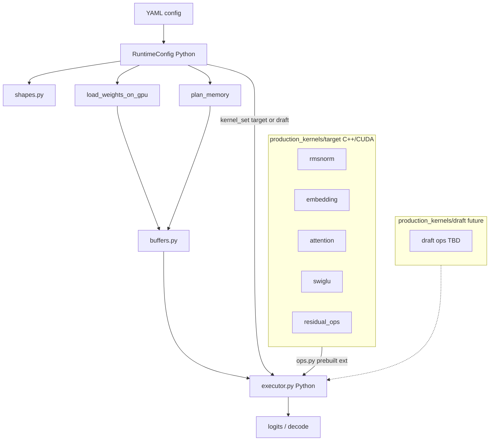

# Qwen2 Python Host + CUDA Kernels Plan

## Architecture Decision

**Python owns the host.** All orchestration — config, memory planning, weight loading, buffer allocation, decoder loop, `prefill()` / `decode_step()` — lives in Python under `runtime/core/` and a new `runtime/executor.py`.

**C++/CUDA owns compute.** Custom kernels stay as `kernel.cu` + `bindings.cpp` with pybind exports. They are **compiled ahead of time** (not JIT at import) and invoked from Python through a thin `ops.py` per op.

**Kernel sets by model role.** CUDA sources live under `production_kernels/<role>/` where `<role>` is `target` (main model) or `draft` (speculative draft model, future). The executor selects the kernel set from config — no flat `production_kernels/<op>/` namespace that would mix the two.

**Why Python host + AOT CUDA (not pure C++ host):** Writing a full inference loop in C++ often becomes a black hole of CMake and boilerplate. The PyTorch playbook — Python for orchestration, C++/CUDA for math — is the pragmatic choice given time constraints. Pre-built extensions + CUDA Graphs on decode (Phase 7) close most of the gap to a native C++ host without abandoning fast iteration.

**Explicitly abandoned:**
- C++ inference host (`runtime/host/`, CMake/LibTorch unified build, `qwen2_runtime` pybind module)
- Runtime JIT via `torch.utils.cpp_extension.load` in `jit.py` — compile once at build time instead

## Philosophy

This is a **scrappy research project**, not production code. Keep the runtime:

- **Config-driven** — one YAML per model, pass the path, everything else derives from it
- **Minimal files** — no enum frameworks, mock dispatch tables, or registry abstractions
- **Kernel-first** — CUDA ops under `production_kernels/<role>/`; Python host calls them via `ops.py`
- **Build vs run separated** — `scripts/build_kernels.sh` compiles extensions; inference imports prebuilt `.so` modules

## Target Topology



## Runtime Layout

```
runtime/
├── core/                              # config, shapes, memory, weights (done)
├── buffers.py                         # Phase 4 — device buffer allocation ✅
├── executor.py                        # Phase 5 — decoder + model loop ✅
├── production_kernels/
│   ├── target/                        # target (main) model kernels — KEEP HERE
│   │   ├── rmsnorm/
│   │   │   ├── kernel.cu
│   │   │   ├── bindings.cpp
│   │   │   └── ops.py                 # Python host ABI
│   │   ├── embedding/
│   │   ├── attention/
│   │   ├── swiglu/
│   │   └── residual_ops/
│   └── draft/                         # draft model kernels (future, same layout)
├── tests/
└── plan.md

scripts/
└── build_kernels.sh                   # AOT compile target/ (+ draft/ when present)

setup.py                               # CUDAExtension definitions for all ops
```

Partner dev artifacts removed — use AOT build + `runtime/tests/test_<op>.py` for correctness.

### YAML is the single source of truth

Each YAML contains:

- Model architecture dims (hidden, layers, heads, intermediate, vocab, rope, etc.)
- `model_path` — where safetensors live (resolved relative to project root)
- Runtime policy (`dtype: fp16`, `cuda_arch: sm_75`)
- Default inference limits (`max_batch`, `max_seq_len`)
- `kv_cache_layout` and `layer_order` (documentation + executor use)
- `kernel_set: target` (or `draft` when draft kernels exist) — which `production_kernels/<role>/` tree to use

Code derives `head_dim`, `kv_dim`, weight shapes, and buffer byte counts — nothing is duplicated.

### Usage

```python
from runtime.core.config import RuntimeConfig, CONFIG_7B
from runtime.core.memory import plan_memory
from runtime.core.weights import load_weights_on_gpu
from runtime.buffers import allocate_buffers
from runtime.executor import Qwen2Executor

cfg = RuntimeConfig.from_yaml(CONFIG_7B, project_root=PROJECT_ROOT)
weights, _ = load_weights_on_gpu(cfg, batch=1)
buffers = allocate_buffers(cfg, batch=1, max_seq_len=512, device="cuda")
executor = Qwen2Executor(cfg, weights, buffers)

logits = executor.prefill(input_ids)        # [B, S, vocab]
next_logits = executor.decode_step(token_id)  # [B, 1, vocab]
```

```bash
source setup.sh
bash scripts/build_kernels.sh          # once per code change / fresh checkout
bash slurm/run_tests_gpu.sh runtime.tests.test_executor.TestExecutorGpu
```

## What We Anchor To

- Reference forward order: `src/reference/modeling_qwen2.py`
- Layer order in YAML: `input_rmsnorm → attention → residual_add → post_attn_rmsnorm → swiglu_mlp → residual_add`
- Target kernels: `runtime/production_kernels/target/` (all ops complete)
- GPU cluster: `.cursor/skills/gpu-cluster/` (SLURM, setup.sh, Turing FP16)

## Build Strategy: AOT, Not JIT

**JIT is not required.** Runtime JIT (`torch.utils.cpp_extension.load` at import) was removed in favor of AOT build.

**Preferred: ahead-of-time compile** via project-root `setup.py` + `scripts/build_kernels.sh`:

1. `setup.py` registers one `CUDAExtension` per op under `target/` with a **dotted module path** (e.g. `runtime.production_kernels.target.rmsnorm.target_rmsnorm_ops`)
2. `build_kernels.sh` sources `setup.sh` (conda + `gnu12`), runs `pip install -e . --no-build-isolation` or `python setup.py build_ext --inplace`
3. Each `ops.py` imports its prebuilt extension from the **same directory** via relative import:

```python
# production_kernels/target/rmsnorm/ops.py
from . import target_rmsnorm_ops as _ext

def forward(input, weight, eps):
    return _ext.forward(input, weight, eps)
```

Build output lands beside the kernel sources, e.g. `runtime/production_kernels/target/rmsnorm/target_rmsnorm_ops.cpython-311-x86_64-linux-gnu.so`.

4. Rebuild only when `kernel.cu` or `bindings.cpp` change; inference startup is instant import

**Why not CMake/LibTorch host build:** per-op `CUDAExtension` via setuptools keeps the Python host in Python while still giving prebuilt binaries. No yaml-cpp/LibTorch duplication.

## Current Status (Phases 1–6 complete)

| Phase | Status | Key artifacts |
|-------|--------|---------------|
| 1 Config + shapes | ✅ | `core/configs/*.yaml`, `RuntimeConfig`, `shapes.py`, `plan_memory()` |
| 2 Weights | ✅ | `load_weights()`, `vram_budget()`, `test_weights.py` |
| 3 Kernel integration | ✅ (3c pending) | `setup.py`, `build_kernels.sh`, five `target/<op>/ops.py`, GPU parity tests |
| 4 Buffers | ✅ | `buffers.py`, `test_buffers.py` (10/10) |
| 5 Executor | ✅ | `executor.py` (`prefill`, `decode_step`, `greedy_extend`, `run_decoder_layer`) |
| 6 Parity harness | ✅ (7B) | `parity_support.py`, `test_decoder_layer.py`, `test_parity_greedy.py`, `test_executor.py` |
| 7 Perf + CUDA graphs | 🔲 | Next |

**Target kernels** (`runtime/production_kernels/target/`):

| Op | AOT `.so` | `ops.py` | GPU tests |
|----|-----------|----------|-----------|
| rmsnorm | ✅ | ✅ | `test_rmsnorm.py` |
| embedding | ✅ | ✅ | `test_embedding.py` |
| attention | ✅ | ✅ (6 sub-ops) | `test_attention.py` (8 tests, 7B / D=128) |
| swiglu | ✅ | ✅ | `test_swiglu.py` |
| residual_ops | ✅ | ✅ | `test_residual_ops.py` |

**GPU test suite on `gpu-turing`:** 37 tests — 25 per-op + 12 parity/executor (layer, greedy, full logits).

```bash
bash slurm/run_tests_gpu.sh runtime.tests.test_decoder_layer
bash slurm/run_tests_gpu.sh runtime.tests.test_parity_greedy
bash slurm/run_tests_gpu.sh runtime.tests.test_executor.TestExecutorGpu
```

**Still open:**
- `kernel_set: target` in YAML + `RuntimeConfig` (executor hardcodes `target` today)
- `runtime/README.md` refresh (buffers, executor, parity tests, AOT layout)
- 0.5B full parity blocked until attention kernels support `head_dim=64`
- Turing alignment validation in `RuntimeConfig.validate()` (Phase 1 checkbox)
- Phase 7: CUDA Graph decode capture

Legacy `src/kernels/rmsnorm/` and per-op `jit.py` / `wrapper.py` / `benchmark.py` are removed; use AOT + `runtime/tests/` only.

## Kernel Host ABI (Python ↔ CUDA boundary)

Each op directory under `runtime/production_kernels/<role>/<op>/`:

```
<role>/<op>/
├── kernel.cu          # CUDA launchers (partner code, unchanged)
├── bindings.cpp       # pybind exports (unchanged)
└── ops.py             # Python host ABI — only file executor imports
```

**Standard single-op pattern** (RMSNorm, embedding, SwiGLU, residual_add, lm_head):

```python
# ops.py — imports prebuilt extension, no JIT
def forward(...) -> Tensor: ...
def workspace_bytes(...) -> int: ...   # 0 if none; optional helper
```

No `init()` required if extensions are prebuilt — import is sufficient. Keep `init()` only if lazy validation or one-time setup is needed.

**Attention is multi-op** — `ops.py` exposes the sub-ops in `target/attention/bindings.cpp`: `qkv_proj_forward`, `rope_forward`, `kv_write_forward`, `fused_attn_forward` (prefill), `decode_attn_forward` (decode), `o_proj_forward`. The Python executor composes these; no monolithic `forward()`.

**Executor import pattern:**

```python
from runtime.production_kernels.target.rmsnorm import forward as rmsnorm_forward
from runtime.production_kernels.target.attention import ops as attn_ops
# future draft:
# from runtime.production_kernels.draft.rmsnorm import forward as draft_rmsnorm_forward
```

Or resolve dynamically from `cfg.kernel_set`.

### Bindings best practices (Phase 3)

Audit all `bindings.cpp` files when wiring `ops.py`:

- **Pass tensors by const reference** — accept `const torch::Tensor&`, not by value, to avoid atomic refcount bumps on every layer call
- **Release the GIL** — wrap the CUDA launch in `py::gil_scoped_release` inside each binding; cheap to add, prevents Python GC or background threads from stalling kernel launches

## Step-by-Step Plan

### Phase 1: YAML config + shape helpers ✅

- [x] `configs/qwen2.5-7b.yaml` and `configs/qwen2.5-0.5b.yaml`
- [x] `RuntimeConfig.from_yaml()` with derived properties
- [x] `shapes.py` and `plan_memory()` — plain functions, no class hierarchies
- [x] Tests in `runtime/tests/test_config.py` and `runtime/tests/test_shapes.py`
- [ ] **Turing alignment checks** — in `shapes.py` or `RuntimeConfig.validate()`, warn/assert that matmul inner dims (hidden, intermediate, head_dim) are multiples of 8 (prefer 16/32) so FP16 Tensor Cores on `sm_75` are not silently bypassed; Qwen2.5 vocab (152064) is already aligned — watch custom seq lengths and any pruning

### Phase 2: Weight loading ✅

- [x] `load_weights(cfg, device)` reads sharded or single safetensors from `cfg.model_path`
- [x] `validate_weights()` checks every expected HF key + shape (incl. q/k/v biases)
- [x] Casts to FP16 per YAML dtype policy; `startup_report()` for memory summary
- [x] Works for both models via whichever YAML is passed in
- [x] Tests in `runtime/tests/test_weights.py` (GPU tests via `bash slurm/run_tests_gpu.sh`)
- [x] `vram_budget()` / `max_seq_len_after_weights()` — compute max seq len from remaining HBM after weights

### Phase 3: Kernel integration (full) — **completed** (3c pending)

**3a. AOT build system** ✅

- [x] Root `setup.py` with dotted `CUDAExtension` per target op (`-arch=sm_75`, `-O3`)
- [x] `scripts/build_kernels.sh` (sources `setup.sh`, `BUILD_KERNEL=all|rmsnorm|…`)
- [x] `.so` colocated in each `target/<op>/` via `build_ext --inplace`
- [x] Removed `jit.py`, `wrapper.py`, `benchmark.py` from all `target/<op>/`

**3b. ops.py + parity tests** ✅ — 25/25 GPU tests on `gpu-turing`

| Op | extension module | Parity test |
|----|------------------|-------------|
| rmsnorm | `target_rmsnorm_ops` | `test_rmsnorm.py` |
| embedding | `target_embedding_ops` | `test_embedding.py` |
| swiglu | `target_swiglu_ops` | `test_swiglu.py` |
| residual_ops | `target_residual_ops` | `test_residual_ops.py` |
| attention | `target_attention_ops` | `test_attention.py` (7B only — kernels templated on `head_dim=128`) |

**3c. Config hook for kernel set** — **pending**

- [ ] Add `kernel_set: target` to YAML configs; expose on `RuntimeConfig`
- [x] Executor accepts `kernel_set=` kwarg but only `"target"` is wired today

**3d. Bindings audit** ✅

- [x] All `target/*/bindings.cpp`: `const torch::Tensor&` + `py::gil_scoped_release`

### Phase 4: Buffer allocation — **completed**

`runtime/buffers.py`:

- `RuntimeBuffers` dataclass + `allocate_buffers(cfg, batch, max_seq_len, device)` sized by `plan_memory()`
- KV cache: layer-major `[L, B, Hkv, S_max, D]`; row strides 16-byte aligned via `kv_cache_head_dim()`
- Ping-pong `hidden_a` / `hidden_b`; Q/K/V scratch; MLP gate; logits; RoPE cos/sin tables; device `cache_position` int64 scalar
- `build_rope_tables()`, `rope_embeddings()`, `swap_hidden()`, `kv_cache_*_layer()`, `memory_report()`, `buffer_fits_vram_budget()`
- `plan_memory()` extended for `rope_cos`, `rope_sin`, fixed `cache_position` bytes
- Tests: `runtime/tests/test_buffers.py` (10/10 CPU+GPU); `test_memory` linear-scaling fix for fixed overhead

### Phase 5: Python decoder + model executor — **completed**

`runtime/executor.py`:

- `Qwen2Executor(cfg, weights, buffers)` — loops `cfg.layer_order`, imports `production_kernels/target/` ops
- `prefill(input_ids)` → `[B, S, vocab]`; resets KV cache; fused attention + RoPE on Q/K
- `decode_step(token_id)` → `[B, 1, vocab]`; decode attention path; host `_cache_pos` mirror + device `cache_position` `fill_`/`add_` (no `.item()` in loop)
- Pre-stacked QKV weights per layer; `head_dim==128` gate (7B attention kernels)
- `greedy_extend(input_ids, n_new)` — correct greedy loop (prefill argmax, then `decode_step`)
- Tests: `runtime/tests/test_executor.py` — stages 3–4 (6 tests total with CPU structure)

### Phase 6: Parity harness — **completed** (7B)

Shared helpers in `runtime/tests/parity_support.py` (`load_hf_and_executor`, `capture_decoder_layer`, `greedy_decode_*`, tolerance constants).

| Stage | Status | Where |
|-------|--------|-------|
| 1. Per-op | ✅ | `test_rmsnorm.py` … `test_attention.py` (25 tests) |
| 2. Single decoder layer | ✅ | `test_decoder_layer.py` — layers 0, mid, last; HF hook vs `run_decoder_layer` |
| 3. Full model logits | ✅ | `test_executor.py` — prefill + decode_step vs HF |
| 4. Greedy decode trajectory | ✅ | `test_parity_greedy.py` — 8- and 16-token trajectories vs `generate()` |

**GPU test notes** (see `.cursor/skills/gpu-cluster/SKILL.md`):

- Run via `bash slurm/run_tests_gpu.sh <module>` — partition max **30 min**
- Parity tests: load **one** HF model copy on GPU (not safetensors + HF — OOM on 24GB)
- Compare logits/hidden in `.float()` (HF fp32 vs kernel fp16)
- Greedy: first new token from **prefill logits**; only later tokens use `decode_step`

### Phase 7: Performance + profiling — **pending**

Only after Phase 6 is stable:

- Timing hooks around embedding, per-layer, lm_head
- Compare tokens/sec vs HF eager baseline on Turing (`gpu-turing`, batch=1)
- Optional: lightweight profiler script in `runtime/tests/` (not in `production_kernels/`)

**CUDA Graphs for decode (highest-impact optimization)**

Python launch overhead is the biggest threat to this architecture. Each `decode_step()` runs ~30 layers × 5+ ops ≈ **150+ kernel launches from Python**, each incurring ~10–50µs pybind/interpret overhead — the GPU starves between tokens.

Because Phase 4 uses static buffers (fixed addresses, no `torch.empty`), capture the full decode step once into a **CUDA Graph** and replay it for subsequent tokens. This bypasses the Python interpreter and pybind on the hot path, approaching C++-host launch latency. Requirements:

- Static tensor addresses and kernel arguments across decode steps ( satisfied by pre-allocated buffers)
- `cache_position` updated on device (see Phase 4/5) — graph reads the device scalar; no host-side int passed per step
- Input token id: write into a fixed device buffer slot before graph replay
- Warmup: one eager `decode_step()` before capture; then `torch.cuda.graph()` capture + `graph.replay()` for generation
- Prefill stays eager (variable seq len); graph applies to decode only

Implement in `executor.py` behind a flag (e.g. `use_cuda_graph=True`) once eager decode parity passes.

## Cleanup

- [x] Removed per-op `jit.py`, `wrapper.py`, `benchmark.py` under `target/`
- [ ] Remove leftover `runtime/host/build/` artifacts if still on disk
- [ ] Update `runtime/README.md` — buffers, executor, AOT build, `production_kernels/target/` layout

## Deferred (add only when needed)

- `production_kernels/draft/` — same layout as target when draft model kernels arrive
- Multi-GPU / speculative decoding (will use target + draft kernel sets)
- Pluggable execution policies / op registries
- CMake unified build or LibTorch C++ host

## Immediate Next Actions

1. **Phase 7:** CUDA Graph decode capture behind `use_cuda_graph` flag; timing hooks / tokens/sec baseline
2. **Phase 3c:** add `kernel_set: target` to YAML + `RuntimeConfig`; wire executor dynamic import
3. **README:** update `runtime/README.md` with buffers, executor, parity tests, AOT build commands
