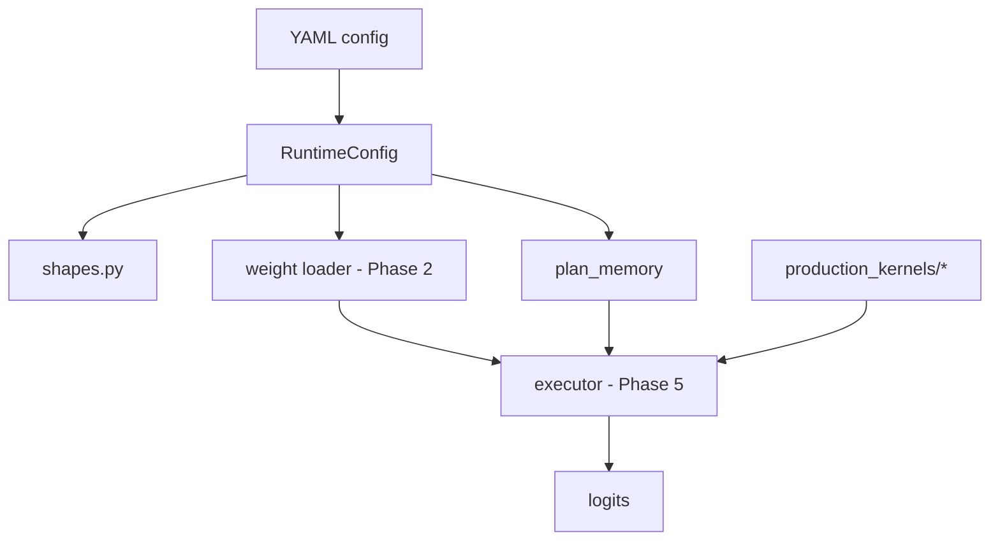

# Qwen2 Native Forward-Pass Execution Plan

## Philosophy

This is a **scrappy research project**, not production code. Keep the runtime:

- **Config-driven** — one YAML per model, pass the path, everything else derives from it
- **Minimal files** — no enum frameworks, mock dispatch tables, or registry abstractions
- **Kernel-first** — `runtime/production_kernels/` holds production CUDA ops; runtime host calls them directly

## Runtime Layout

```
runtime/
├── core/
│   ├── configs/
│   │   ├── qwen2.5-7b.yaml   # 7B dims, dtype policy, model path
│   │   └── qwen2.5-0.5b.yaml
│   ├── config.py             # RuntimeConfig.from_yaml(path)
│   ├── shapes.py             # hidden(), kv_cache(), weight_shapes(), etc.
│   ├── memory.py             # plan_memory(cfg) → dict of shapes + byte counts
│   └── weights.py            # load_weights(cfg) → FP16 tensors on device
├── production_kernels/       # CUDA ops (rmsnorm, …)
├── tests/                    # unit tests
└── plan.md
```

### YAML is the single source of truth

Each YAML contains:

- Model architecture dims (hidden, layers, heads, intermediate, vocab, rope, etc.)
- `model_path` — where safetensors live (resolved relative to project root)
- Runtime policy (`dtype: fp16`, `cuda_arch: sm_75`)
- Default inference limits (`max_batch`, `max_seq_len`)
- `kv_cache_layout` and `layer_order` (documentation + future executor use)

Code derives `head_dim`, `kv_dim`, weight shapes, and buffer byte counts — nothing is duplicated.

### Usage

```python
from runtime.core.config import RuntimeConfig, CONFIG_7B
from runtime.core.memory import plan_memory

cfg = RuntimeConfig.from_yaml(CONFIG_7B, project_root=PROJECT_ROOT)
plan = plan_memory(cfg, batch=1, max_seq_len=512)
```

Same API for 0.5B — just pass `CONFIG_05B` or any compatible YAML.

## What We Anchor To

- Reference forward order: `src/reference/modeling_qwen2.py`
- Production kernels: `runtime/production_kernels/` (RMSNorm integrated)
- GPU cluster: `.cursor/skills/gpu-cluster/` (SLURM, setup.sh, Turing FP16)

## Target Topology



## Step-by-Step Plan

### Phase 1: YAML config + shape helpers ✅

- [x] `configs/qwen2.5-7b.yaml` and `configs/qwen2.5-0.5b.yaml`
- [x] `RuntimeConfig.from_yaml()` with derived properties
- [x] `shapes.py` and `plan_memory()` — plain functions, no class hierarchies
- [x] Tests in `runtime/tests/test_config.py` and `runtime/tests/test_shapes.py`

### Phase 2: Weight loading ✅

- [x] `load_weights(cfg, device)` reads sharded or single safetensors from `cfg.model_path`
- [x] `validate_weights()` checks every expected HF key + shape (incl. q/k/v biases)
- [x] Casts to FP16 per YAML dtype policy; `startup_report()` for memory summary
- [x] Works for both models via whichever YAML is passed in
- [x] Tests in `runtime/tests/test_weights.py` (GPU tests via `bash slurm/run_tests_gpu.sh`)
- [x] `vram_budget()` / `max_seq_len_after_weights()` — compute max seq len from remaining HBM after weights

### Phase 3: Kernel integration (incremental)

- [x] RMSNorm in `runtime/production_kernels/rmsnorm/` — `init()` / `workspace_bytes()` / `forward()`
- [x] Stripped monkey-patching (`wrapper.py` removed); host passes tensors directly
- [x] Parity tests vs HF + loaded model weights (`runtime/tests/test_rmsnorm.py` only — no bench code in `production_kernels/`)
- [ ] Remaining kernels (attention, SwiGLU, lm_head) as partner delivers them
- [ ] Wire into decoder loop (Phase 5) — blocked until all ops ready

### Phase 4: Buffer allocation

- Allocate device buffers sized by `plan_memory(cfg, batch, max_seq_len)`
- KV cache: layer-major `[L, B, Hkv, S_max, D]` per YAML
- Ping-pong hidden states; no per-step `torch.empty` during decode

### Phase 5: Decoder + model executor

- One `executor.py` (or C++ equivalent) that loops `cfg.layer_order`
- Mirror `Qwen2DecoderLayer` ordering exactly
- `prefill(input_ids)` and `decode_step(token_id)` APIs

### Phase 6: Parity harness

- Compare against HF `modeling_qwen2` at op → layer → logits → decode trajectory
- Run on 0.5B for fast iteration, validate on 7B before milestones
- Tests live in `runtime/tests/`

### Phase 7: Performance + profiling

- Timing around embedding, per-layer ops, lm_head
- Only after parity is stable

## Deferred (add only when needed)

- Multi-GPU / speculative decoding interfaces
- Pluggable execution policies
- Tensor registry / weight kind enums / mock op tables

## Immediate Next Actions

1. Partner delivers remaining production kernels → same `ops.py` pattern as RMSNorm
2. Phase 4: allocate activation + KV-cache buffers from `plan_memory()`
3. Phase 5: decoder loop calls `production_kernels/*/ops.forward()` with weights from `load_weights()`
